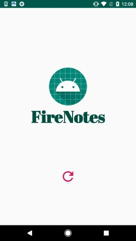
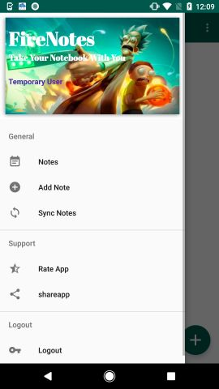
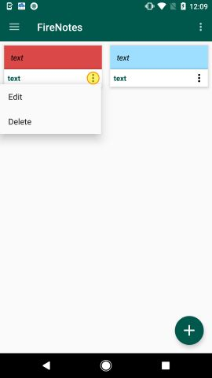
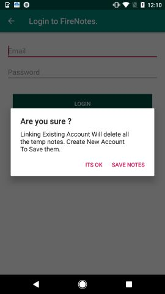
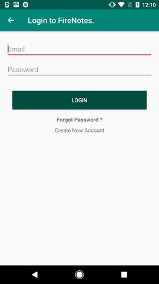
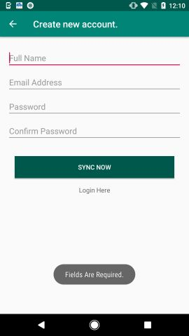

# FiresNotes

Hello Everyone,
I am going to build a note-taking application and publish on google play store.

The Features of This Android Note Taking Application is :

 1. Firebase Email Authentication.
 2. Firebase Anonymous Authentication
 3. Create, Update, Delete Notes
 4. Display Firebase Data in RecyclerView
 5. Android Splash Screen
 6. Firebase Cloud Firestore for Storage and Many more.
 
 
   
 
 
 
 
 

